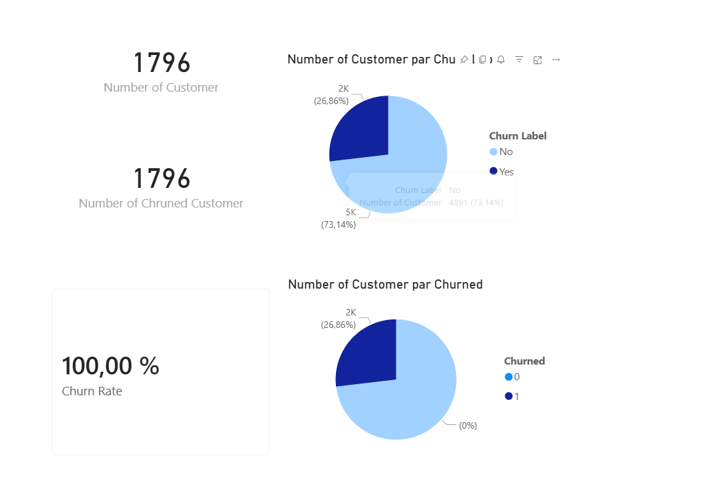
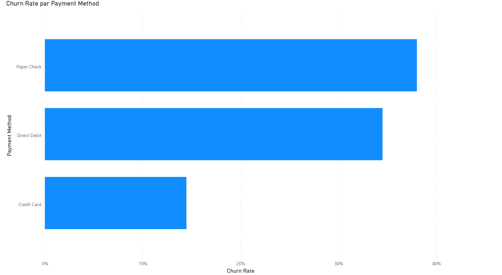
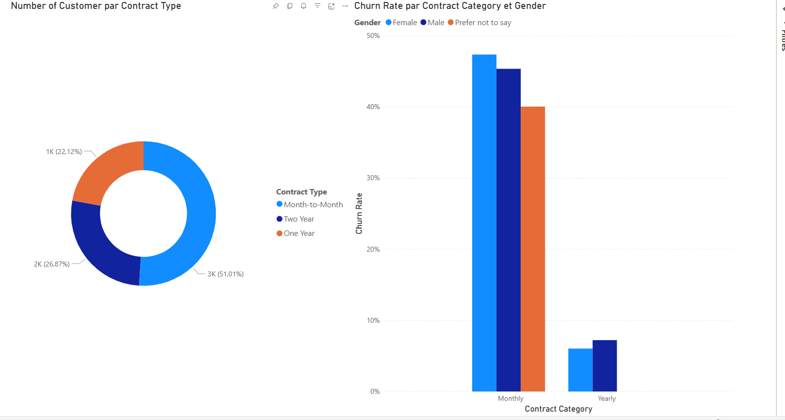
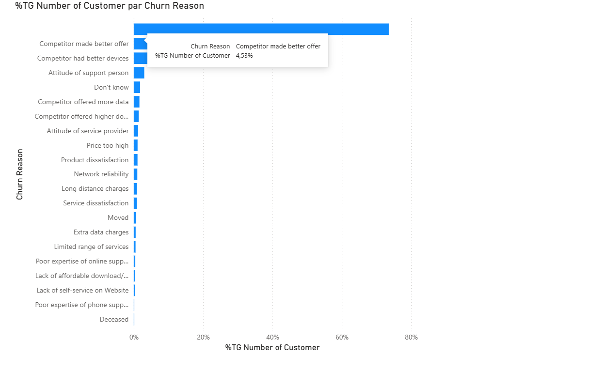

# 📊 Analyse du Taux de Désabonnement Client — Databel (Power BI)

## 🎯 Objectif
Comprendre les causes du churn chez l'opérateur télécom Databel,
identifier les segments les plus à risque et proposer des leviers
d'action concrets pour améliorer la rétention client.

## 📁 Dataset
- **Source** : Dataset Databel (données télécom simulées)
- **Volume** : 6 687 clients, 29 variables
- **Outil** : Microsoft Power BI Desktop (DAX)

## 📈 Indicateurs clés
| Métrique | Valeur |
|----------|--------|
| Taux de churn global | 26,9 % |
| Clients churné | 1 796 |
| Charge mensuelle moyenne | ~65 $ |
| Norme sectorielle | 15–25 % |

> ⚠️ Le taux de 26,9 % dépasse les standards du secteur télécom —
> un enjeu fort de rétention client est à adresser en priorité.

## 🔍 Pages d'analyse du dashboard
- **Data Check** — vérification qualité des données
- **Churn Category & Reason** — causes principales de départ
- **Démographie & Âge** — profil des clients à risque
- **Contrats** — impact du type d'engagement sur le churn
- **Plan Data & Appels Internationaux** — adéquation offre/usage
- **Géographie** — disparités par État américain
- **Méthode de paiement** — corrélation paiement et rétention

## 💡 Insights clés

**🔴 La concurrence, moteur n°1 du churn**
Près de 45% des clients partent pour une offre concurrente
plus attractive (meilleur appareil, meilleur forfait, prix plus bas).

**👴 Les seniors, segment le plus vulnérable**
Les clients 65+ churent à ~38%, soit 40% au-dessus de la moyenne.
Un accompagnement dédié est nécessaire pour ce segment.

**📄 Le type de contrat, prédicteur majeur**
| Type de contrat | Taux de churn |
|----------------|---------------|
| Month-to-Month | ~46 % 🔴 |
| One Year | ~11 % 🟡 |
| Two Year | ~3 % 🟢 |

**📍 La Californie, cas critique**
Taux de churn estimé à ~63% en Californie — investigation locale requise.

## 🎯 Recommandations stratégiques
1. 🔴 Incentiver les contrats longue durée (remise 2 ans) → clients Month-to-Month
2. 🔴 Programme de fidélisation seniors spécifique → 65+ ans
3. 🟠 Recommandation proactive du plan illimité → gros consommateurs
4. 🟠 Plan d'action dédié Californie → marché local
5. 🟡 Amélioration de l'expérience onboarding → nouveaux clients (0-6 mois)

## 🛠️ Stack technique
- **Power BI Desktop** — modélisation, visualisation
- **DAX** — mesures : Churn Rate, Number of Churned Customers,
  Number of Customers
- **CSV** — source de données brutes

## 📸 Aperçu du dashboard
### Vue générale & KPIs

### Causes du churn

### Analyse démographique

### Analyse contractuelle

## 👤 Auteur
**Haroun Elias**
[LinkedIn](https://linkedin.com/in/elias-haroun) ·
[GitHub](https://github.com/Eliashrn)
